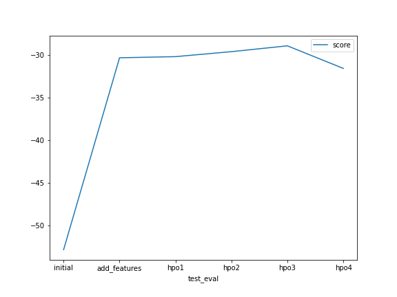
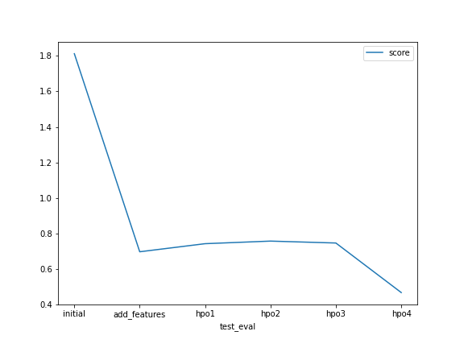
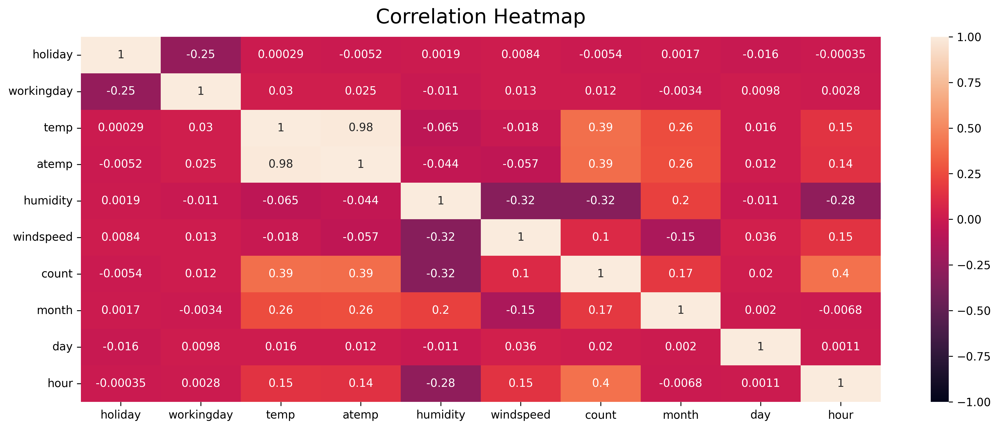

# Report: Predict Bike Sharing Demand with AutoGluon Solution
#### Tatiana Gissi Fonseca

## Initial Training
### What did you realize when you tried to submit your predictions? What changes were needed to the output of the predictor to submit your results?
I had to make sure all predicted values were bigger than zero, setting any lower value to zero. Then I saved the results as a CSV file using the Sample submission file as a model just replacing the "count" column.

### What was the top ranked model that performed?
WeightedEnsemble_L3.

## Exploratory data analysis and feature creation
### What did the exploratory analysis find and how did you add additional features?
The EDA found there were no missing values, some features with the wrong data type (float instead of category, for example) that could mislead the model predictions, differences between training and test features, the datetime distribution demanded more granularity to actually get some useful information out of it (as seasonality), and unbalanced features. I split the "datetime" column into month, day and hour.

### How much better did your model preform after adding additional features and why do you think that is?
The model perfomed about 62% better after the new features addition. I think the increase of the date granularity facilitated to better notice the seasonality and other pattern nuances that affects the bike sharing demand.

## Hyper parameter tuning
### How much better did your model preform after trying different hyper parameters?
Actually it performed a little worse in my first attempts, but at least it improved considerably, about 33% compared to "add_features" model.

### If you were given more time with this dataset, where do you think you would spend more time?
Both on exploratory analysis to do some additional feature engineering as on hyperparameters tunning.

### Create a table with the models you ran, the hyperparameters modified, and the kaggle score.
model        |time_limit |presets	              |auto_stack |num_bag_folds |num_bag_sets |hyperparameters	|hyperparameter_tune_kwargs	|refit_full	|score
------------ |---------- |----------------------- |---------- |------------- |------------ |--------------- |-------------------------- |---------- |-------
initial	     |600        |best_quality            |True	      |8	         |20	       |default	        |None	                    |False	    |1.81268
add_features |600	     |best_quality            |True	      |8	         |20	       |default	        |None	                    |False	    |0.69588
hpo1         |720	     |high_quality	          |True	      |8	         |20	       |default	        |None	                    |False	    |0.74147
hpo2	     |1200	     |best_quality	          |True	      |5	         |2	           |default	        |None	                    |False	    |0.75607
hpo3	     |1200	     |optimize_for_deployment |True	      |10	         |20	       |default	        |None	                    |False	    |0.74527
hpo4	     |1200	     |high_quality	          |True	      |10	         |20	       |light	        |random	                    |True	    |0.46589

### Create a line plot showing the top model score for the three (or more) training runs during the project.

### Create a line plot showing the top kaggle score for the three (or more) prediction submissions during the project.-

### Correlation matrix of all features

## Summary
The exploratory analysis is fundamental for understanding your data and how you can improve its quality for model training by cleaning, transforming it or doing some feature engineering. Also EDA is important in order to have the best insights of what is useful or not to solve the problem or to achieve the business need you face. The better you know your data and business, the better you can choose between many machine learning algorithms or simpler solutions. And the better you know the algorithm, the better you can optmize it through hyperparameter tuning. In this project, feature engineering helped the model to more accurately interpret the data, to notice subtle patterns such as seasonality, and to have a faster performance by discarding unnecessary features. The hyperparameters tuning improved the performance through the "refit_full" parameter and "light" hyperparameter allowing faster training. It also raised the score by using random hyperparameters optimizations already known by AutoGluon.
